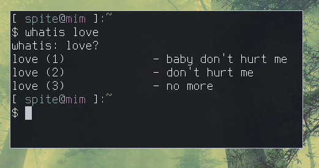

# whatis love
This is a bash script to customize the output of "whatis" command when passed "love" as an argument.



This script checks to see if the first argument is a specific string, in this case "love." If it matches, it echoes a fake "whatis" output with the first few lyrics of Haddaway's What Is Love.

I mostly created this to link to it in the description of the [video](https://youtu.be/MNZuwRDdQ6g) I made using this script. I strongly suggest writing your own version of the program, as this is an extremely simple script.

## How to use?
Alias "whatis" to the script. Example:
```bash
alias whatis='bash ~/.config/whatis.sh'
```

If you find some horrible flaw in my 11 lines of code, pull requests are welcome.
